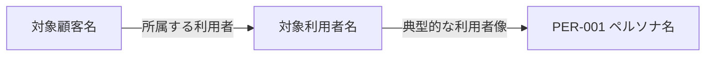
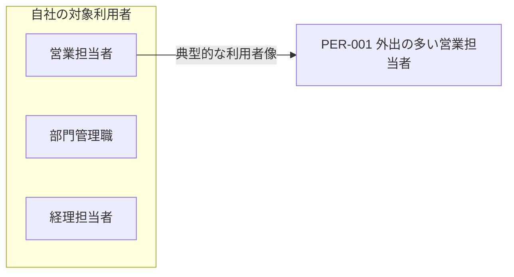

# ターゲットとペルソナ

## 1. 概要

<!-- ターゲットとペルソナを何の判断に利用するかを記載する。 -->

## 2. 対象顧客

<!-- 顧客向けプロダクトの場合に、提供対象となる組織や顧客層を記載する。社内システムなどで該当しない場合は、その旨を記載する。 -->

| 対象顧客 | 抱えている課題 | 対象とする理由 |
|---|---|---|
|  |  |  |

## 3. 対象利用者

<!-- 実際にシステムを操作・利用する人の役割、環境、頻度、目的を記載する。 -->

| 対象利用者 | 役割 | 利用環境・頻度 | 主な目的 |
|---|---|---|---|
|  |  |  |  |

## 4. ペルソナを使用する目的
<!-- ペルソナを用いて判断するUI・UX、優先順位、利用シーンを記載する。 -->

## 5. ペルソナ
<!-- 調査または明示した仮定に基づく典型的な利用者像だけを記載する。 -->

### PER-001 ペルソナ名
<!-- 属性そのものではなく、利用状況、目的、困りごと、期待を要件判断に使える粒度で記載する。 -->

- 利用者の種類:
- 役割:
- 経験・習熟度:
- 利用頻度:
- 利用環境:
- 目的:
- 困りごと:
- 期待すること:
- 関連するスコープ・業務フロー:

## 6. ターゲットとペルソナの対応図

<!-- Mermaidで対象顧客・対象利用者・ペルソナの対応を示す。以下は差し替え用の構造例。本文と名称・PER-IDを一致させ、矢印には関係の意味を付ける。所属関係は確認できる場合だけ示す。 -->
<!-- 対象顧客が該当しない場合は顧客ノードを省き、自社など実際のまとまりをsubgraphにする。ペルソナを定義していない利用者も残し、図のために人物像や対応関係を捏造しない。仮定・未確定の関係は図中にも明記する。 -->



## 7. 根拠と仮定

<!-- ヒアリング、観察、調査などの根拠と、検証が必要な仮定を区別する。 -->

## 8. 未確定事項

<!-- 詳細は appendices/open-issues.md を正本とし、重要項目を参照する。 -->

<!-- BEGIN REFERENCE EXAMPLE: 実案件の成果物にはこの記入例セクションを含めない -->
## 記入例（参考・成果物には含めない）

以下は記入の粒度を確認するための例であり、上のテンプレートへそのまま転記しない。

<details open>
<summary>記入例を表示</summary>

架空の「社内経費精算システム」を題材に、対応するテンプレートの全項目を示す。例の固有名詞、数値、属性、判断を実案件へ転用しない。

## 02-targets-and-personas.md

```yaml
---
title: ターゲットとペルソナ
status: draft
owner: 業務分析担当者
reviewers:
  - 利用部門代表者
  - 経理部責任者
last_updated: 2026-08-30
---
```

# ターゲットとペルソナ

## 1. 概要

本書では、経費精算システムの主な利用者と典型的な利用状況を整理し、
画面、操作方法、優先順位を利用者視点で検討するために使用する。

## 2. 対象顧客

本システムは社内利用を目的としており、外部へ販売するプロダクトではないため、
対象顧客は設定しない。対象となる社内利用者は次節で定義する。

| 対象顧客 | 抱えている課題 | 対象とする理由 |
|---|---|---|
| 該当なし | 社内システムのため外部顧客を持たない | 対象利用者を基準に要件を検討する |

## 3. 対象利用者

| 対象利用者 | 役割 | 利用環境・頻度 | 主な目的 |
|---|---|---|---|
| 営業担当者 | 経費の申請 | 外出先のスマートフォン、週数回 | 支払い直後に申請を記録する |
| 部門管理職 | 申請の承認 | PCとスマートフォン、毎営業日 | 部下の申請を滞留させず処理する |
| 経理担当者 | 経理確認と会計連携 | 社内PC、毎営業日 | 規程確認と転記を効率化する |

## 4. ペルソナを使用する目的

- スマートフォンで優先して提供する操作を判断する。
- 入力支援とエラー表示の必要性を検討する。
- 申請者と経理担当者で異なる利用頻度や習熟度を要件へ反映する。

## 5. ペルソナ

### PER-001 外出の多い営業担当者

- 利用者の種類: 申請者
- 役割: 顧客訪問に伴う交通費と交際費を申請する。
- 経験・習熟度: 営業経験3年、スマートフォン操作には慣れているが経費規程には詳しくない。
- 利用頻度: 週3回から5回
- 利用環境: 移動中または訪問直後に会社支給スマートフォンを利用する。
- 目的: 領収書を紛失する前に短時間で申請を記録する。
- 困りごと: 月末に領収書をまとめて整理する負担が大きく、経費区分の判断に迷う。
- 期待すること: 入力途中で保存でき、選択すべき経費区分を理解できること。
- 関連するスコープ・業務フロー: 経費申請、BP-001

## 6. ターゲットとペルソナの対応図



対象顧客は設定していないため、顧客ノードは置かない。
PER-001は営業担当者の典型的な利用者像であり、別の実在人物を示すものではない。
部門管理職と経理担当者は対象利用者だが、本書では個別のペルソナを定義していない。
図は対象と利用者像の対応を示し、業務の処理順や関係者間の影響は示さない。

## 7. 根拠と仮定

- 確認済み: 営業担当者5名へのヒアリングで、外出先からの入力需要を確認した。
- 確認済み: 直近3か月の申請記録から、営業部門の申請頻度を集計した。
- 仮定: 訪問直後に入力できれば領収書紛失と月末の作業負担が減る。
- 仮定: 経費区分の説明を画面に表示すれば問い合わせが減る。

## 8. 未確定事項

- ISSUE-016: スマートフォンのみで申請を完了する必要があるか
- ISSUE-017: 経費区分の選択支援に必要な説明内容

詳細は `appendices/open-issues.md` を参照する。

</details>
<!-- END REFERENCE EXAMPLE -->
