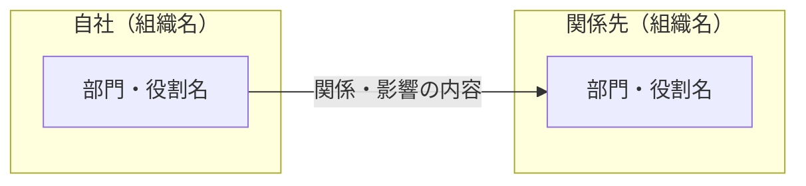
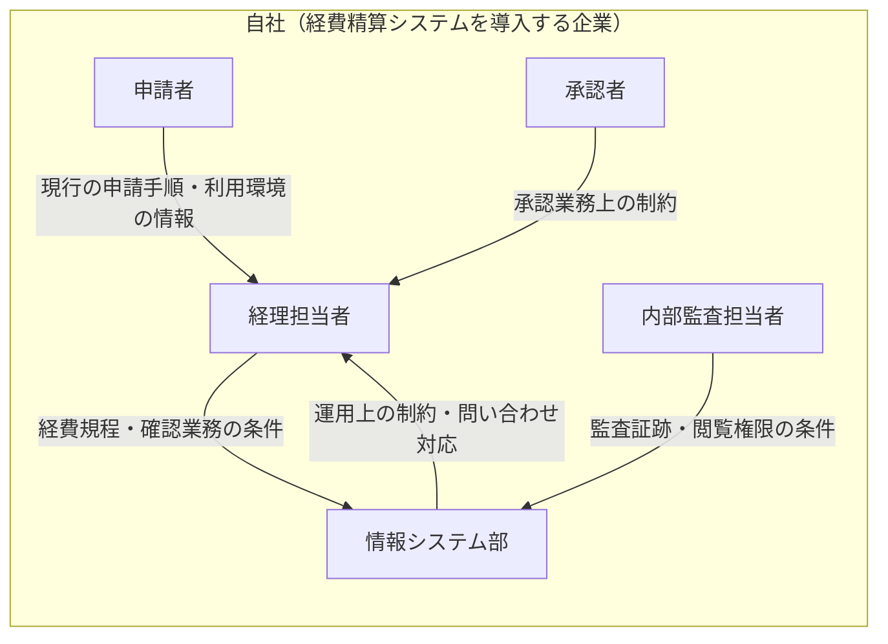

# ステークホルダー

## 1. 文書の目的

<!-- 誰がプロジェクトに関係し、どのような影響を受けるか、または与えるかを記載する。具体的なシステムの振る舞いは機能要件へ記載する。 -->

## 2. ステークホルダー一覧

<!-- 利用者に限らず、業務、規程、運用、意思決定へ影響する個人・組織を記載する。 -->

<!-- 自社、顧客企業、外部委託先など、確認できた所属・組織ごとに見出しと表を作る。自社が指す組織を明記する。同じ組織内でも影響が異なる部門・役割は行を分ける。該当しないまとまりは削除し、所属不明は未確定とする。 -->

### 2.1 自社（組織名）

| ステークホルダー | プロジェクトとの関係 | 影響を受けること・与えること |
|---|---|---|
|  |  |  |

### 2.2 関係先（組織名）

| ステークホルダー | プロジェクトとの関係 | 影響を受けること・与えること |
|---|---|---|
|  |  |  |

## 3. 直接利用者

<!-- ステークホルダーのうち、システムを直接操作または利用する人を識別する。具体的な目的や要求は記載しない。 -->

## 4. ステークホルダー関係図

<!-- 一覧と同じまとまりをsubgraphにし、内部の部門・役割をノードにする。以下は差し替え用の構造例。実在する関係者と確認できた関係だけを残し、矢印に関係・影響の意味を付ける。業務手順や承認経路を表す図にはしない。 -->



## 5. 影響関係の補足

<!-- 一覧・図だけでは分かりにくい影響を、組織単位でまとめて補足する。関係が双方向の場合は、それぞれの向きの意味を明記する。 -->

## 6. 未確定事項

<!-- 詳細は appendices/open-issues.md を正本とし、重要項目を参照する。 -->

<!-- BEGIN REFERENCE EXAMPLE: 実案件の成果物にはこの記入例セクションを含めない -->
## 記入例（参考・成果物には含めない）

以下は記入の粒度を確認するための例であり、上のテンプレートへそのまま転記しない。

<details open>
<summary>記入例を表示</summary>

架空の「社内経費精算システム」を題材に、対応するテンプレートの全項目を示す。例の固有名詞、数値、日付、方式、判断を実案件へ転用しない。

## 03-stakeholders.md

```yaml
---
title: ステークホルダー
status: approved
owner: プロジェクト責任者
reviewers:
  - 経理部責任者
  - 情報システム部責任者
last_updated: 2026-08-28
---
```

# ステークホルダー

## 1. 文書の目的

本書は、プロジェクトに関係する個人・組織・利用者と、
それぞれが受ける影響、およびプロジェクトへ与える影響を明確にする。
具体的なシステムの振る舞いは機能要件で定義し、業務上の手順は業務フローで定義する。

## 2. ステークホルダー一覧

### 2.1 自社（経費精算システムを導入する企業）

本書の「自社」はシステムの開発受託企業ではなく、導入・利用する企業を指す。
以下の関係者は全員、自社に所属する。業務委託者の扱いは未確定事項を参照する。

| ステークホルダー | プロジェクトとの関係 | 影響を受けること・与えること |
|---|---|---|
| 申請者 | 経費を申請する直接利用者 | 申請手順が変わる。現行業務の情報を要件検討へ提供する |
| 承認者 | 申請内容を確認する直接利用者 | 承認手順と日常業務が変わる。承認業務上の制約を要件へ与える |
| 経理担当者 | 経費を確認・処理する直接利用者 | 確認業務と会計連携業務が変わる。経費規程を要件へ反映する |
| 情報システム部 | システムを運用する組織 | 運用対象と問い合わせ対応が増える。既存環境と運用上の制約を与える |
| 内部監査担当者 | 証跡を確認する直接利用者 | 監査時の確認方法が変わる。監査上必要な証跡の条件を与える |

## 3. 直接利用者

申請者、承認者、経理担当者、内部監査担当者を直接利用者とする。

## 4. ステークホルダー関係図



矢印は関係者間の情報・条件の提供や影響を示し、申請処理の順序や承認経路は示さない。
外部組織の関与は本例では確定していないため、図に追加しない。

## 5. 影響関係の補足

### 5.1 自社

#### 申請者

- 紙と表計算ファイルを用いた現行の申請手順から、システム上の手順へ変更される。
- 操作方法の周知と、移行期間中の問い合わせ対応の影響を受ける。
- 現行の申請手順と利用環境に関する情報をプロジェクトへ提供する。

#### 承認者

- 部門ごとに異なる承認手順が標準化される影響を受ける。
- 代理承認や承認権限に関する業務上の制約をプロジェクトへ与える。

#### 経理担当者

- 申請内容の確認方法と会計システムへの登録手順が変わる。
- 経費規程、締め処理、保存期間に関する条件をプロジェクトへ与える。

#### 情報システム部

- 新たな運用対象として監視、障害対応、問い合わせ対応を担う。
- 既存の認証基盤、端末管理、運用体制に関する制約をプロジェクトへ与える。

#### 内部監査担当者

- 監査時に参照する記録と確認手順が変わる。
- 監査証跡の対象、保存、閲覧権限に関する条件をプロジェクトへ与える。

## 6. 未確定事項

- ISSUE-003: 代理承認者の役割と権限
- ISSUE-012: 業務委託者を申請者へ含めるか

</details>
<!-- END REFERENCE EXAMPLE -->
