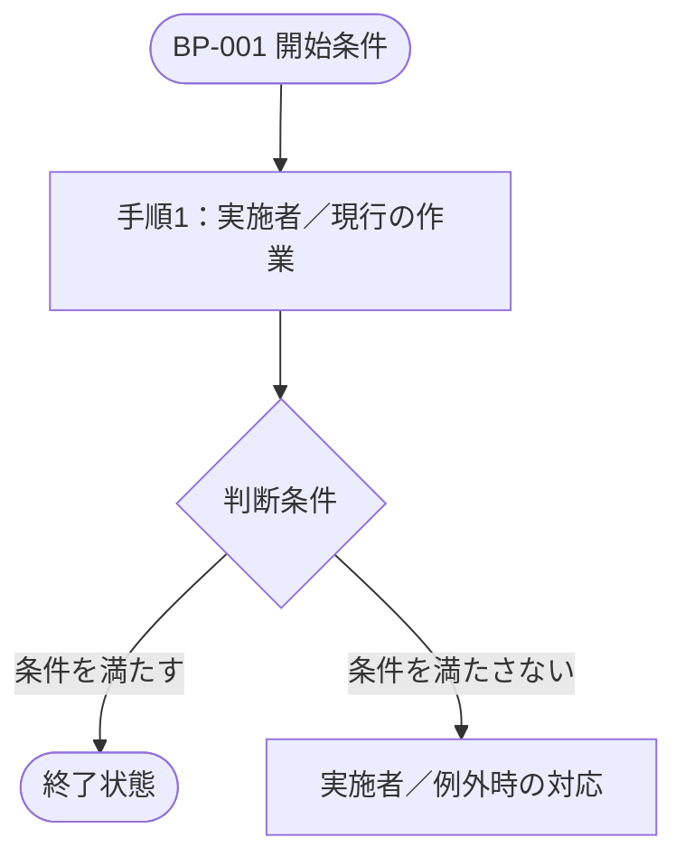
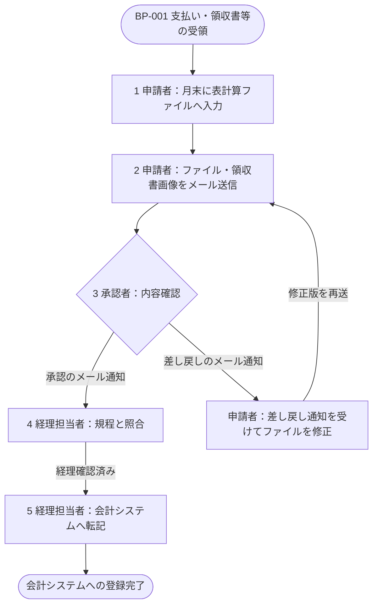
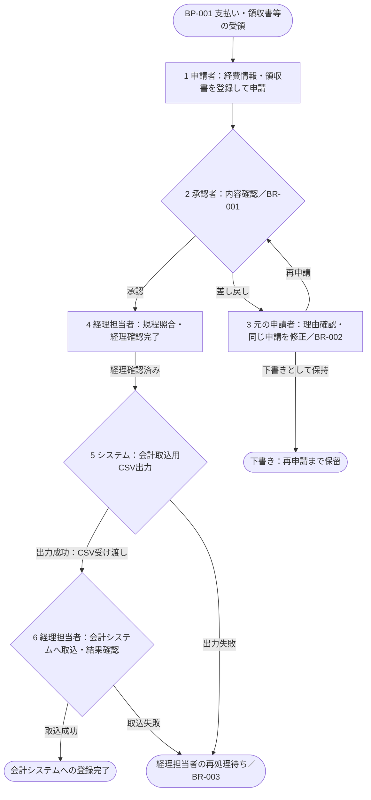

# 業務フロー Before／After

## 1. 文書の目的

<!-- 現行業務から将来業務への変更を、何の合意や判断に使用するかを記載する。 -->

## 2. 対象業務

<!-- 比較する業務の開始・終了、関連するスコープを業務単位で記載する。 -->

| ID | 対象業務 | 開始 | 終了 | 関連するスコープ |
|---|---|---|---|---|
| BP-001 |  |  |  |  |

## 3. 現行業務（Before）

<!-- 現在実際に行われている業務を、確認できた事実と根拠に基づいて記載する。 -->

### 3.1 業務の開始条件
<!-- 現行業務が開始するイベント、入力、時点を記載する。 -->

### 3.2 関係者
<!-- 現行業務へ参加する役割と担当する作業を記載する。 -->

### 3.3 業務の流れ
<!-- 現行の手順を実施者、入力、出力・状態とともに時系列で記載する。 -->

<!-- 業務ごとにMermaid図を作り、BP-ID、開始・終了、担当、受け渡し、判断条件、差し戻し・例外を示す。以下は差し替え用の構造例。確認できない現行手順を補完せず未確定と記載する。図中の手順番号を下表と対応させる。 -->



| 手順 | 実施者 | 作業 | 入力 | 出力・状態 |
|---|---|---|---|---|
| 1 |  |  |  |  |

### 3.4 課題

<!-- 確認できた現行業務の課題と根拠を記載する。解決策は混在させない。 -->

## 4. 将来業務（After）

<!-- プロジェクト後に合意したい業務を、役割・手順・状態の変化が分かる形で記載する。 -->

### 4.1 業務の開始条件
<!-- 将来業務が開始するイベント、入力、時点を記載する。 -->

### 4.2 関係者
<!-- 将来業務へ参加する役割と、変更される責任を記載する。 -->

### 4.3 業務の流れ
<!-- 将来の手順を実施者、入力、出力・状態とともに時系列で記載する。 -->

<!-- Beforeと同じ業務範囲・粒度のMermaid図を作り、変更後の担当・受け渡し・分岐を示す。図中の手順番号を下表と対応させ、判断条件・例外は業務ルールを参照する。未合意の案は明示する。 -->


| 手順 | 実施者 | 作業 | 入力 | 出力・状態 |
|---|---|---|---|---|
| 1 |  |  |  |  |

### 4.4 変更点

<!-- Beforeから変更する業務、役割、受け渡し、判断を記載する。具体的なシステムの振る舞いは機能要件へ記載する。 -->

## 5. Before／After比較

<!-- 手順、役割、受け渡し、時間、判断など重要な差分と変更理由を記載する。 -->

| 観点 | Before | After | 変更理由 |
|---|---|---|---|
|  |  |  |  |

## 6. 業務ルールと例外

<!-- 将来業務に適用する判断条件、禁止事項、例外時の業務対応を記載する。 -->

| ID | 区分 | 内容 | 適用箇所 |
|---|---|---|---|
| BR-001 | ルール／例外 |  |  |

## 7. 関連する機能要件

<!-- 業務フローを実現する機能要件との対応を記載し、機能本文は複製しない。 -->

| 対象業務 | 機能要件 | 関係 |
|---|---|---|
| BP-001 | FR-001 |  |

## 8. 仮定と未確定事項

<!-- 仮定は appendices/assumptions-and-constraints.md、未確定事項は appendices/open-issues.md を正本として参照する。 -->

<!-- BEGIN REFERENCE EXAMPLE: 実案件の成果物にはこの記入例セクションを含めない -->
## 記入例（参考・成果物には含めない）

以下は記入の粒度を確認するための例であり、上のテンプレートへそのまま転記しない。

<details open>
<summary>記入例を表示</summary>

架空の「社内経費精算システム」を題材に、対応するテンプレートの全項目を示す。例の固有名詞、数値、業務ルール、判断を実案件へ転用しない。

## 目次

- 05-business-process-before-and-after.md
- 文書の目的
- 対象業務
- 現行業務（Before）
- 将来業務（After）
- Before／After比較
- 業務ルールと例外
- 関連する機能要件
- 仮定と未確定事項

## 05-business-process-before-and-after.md

```yaml
---
title: 業務フロー Before／After
status: in-review
owner: 業務分析担当者
reviewers:
  - 経理部責任者
  - 営業部代表者
last_updated: 2026-08-31
---
```

# 業務フロー Before／After

## 1. 文書の目的

本書は、経費申請から会計システムへの登録までの現行業務と将来業務を比較し、
変更する手順、役割、受け渡し、業務ルールについて関係部門の合意を得るために使用する。

## 2. 対象業務

| ID | 対象業務 | 開始 | 終了 | 関連するスコープ |
|---|---|---|---|---|
| BP-001 | 経費の申請・承認・経理確認 | 従業員が業務上の支払いを行う | 承認済み経費が会計システムへ登録される | 経費申請、承認、経理確認、会計連携 |

## 3. 現行業務（Before）

### 3.1 業務の開始条件

従業員が交通費、宿泊費、交際費などの業務上の支払いを行い、領収書または利用記録を受領した時点で開始する。

### 3.2 関係者

- 申請者: 表計算ファイルへ経費を入力し、領収書とともに提出する。
- 承認者: メールで届いた申請内容を確認する。
- 経理担当者: 規程との整合を確認し、会計システムへ転記する。

### 3.3 業務の流れ



図の番号は下表の手順に対応する。差し戻し後はファイルを修正して再送する。

| 手順 | 実施者 | 作業 | 入力 | 出力・状態 |
|---|---|---|---|---|
| 1 | 申請者 | 月末に領収書を集め、表計算ファイルへ入力する | 領収書、交通費の利用記録 | 経費申請ファイル |
| 2 | 申請者 | 申請ファイルと領収書画像を承認者へメール送信する | 経費申請ファイル、領収書画像 | 承認待ち |
| 3 | 承認者 | 内容を確認し、承認または差し戻しをメールで通知する | 申請メール | 承認済みまたは差し戻し |
| 4 | 経理担当者 | 承認済みの申請を規程と照合する | 申請ファイル、領収書画像、経費規程 | 経理確認済み |
| 5 | 経理担当者 | 申請内容を会計システムへ転記する | 経理確認済み申請 | 会計システムへの登録完了 |

### 3.4 課題

- 確認済み: 申請者へのヒアリングで、月末に入力作業が集中していることを確認した。
- 確認済み: 申請の状態がメール上に分散し、申請者と経理担当者が進捗を一覧できない。
- 確認済み: 経理担当者が申請内容を会計システムへ再入力している。
- 確認済み: 差し戻し後のファイルが複数存在し、最新版の判別に時間を要する。

## 4. 将来業務（After）

### 4.1 業務の開始条件

従業員が業務上の支払いを行い、領収書または利用記録を受領した時点で開始する。

### 4.2 関係者

- 申請者: 支払い後に経費情報と領収書をシステムへ登録する。
- 承認者: システム上で申請内容を確認する。
- 経理担当者: システム上で規程との整合を確認し、出力したCSVを会計システムへ取り込む。

### 4.3 業務の流れ



図はレビュー中の将来業務案であり、番号は下表の手順に対応する。
下書き・再処理待ちは業務完了ではなく保留状態を示す。
再処理の自動化はISSUE-019で未確定のため、自動再実行の経路は記載しない。

| 手順 | 実施者 | 作業 | 入力 | 出力・状態 |
|---|---|---|---|---|
| 1 | 申請者 | 支払い後に経費情報と領収書画像を登録し、申請する | 支払情報、領収書画像 | 承認待ち |
| 2 | 承認者 | 申請内容を確認し、承認または差し戻しを記録する | 承認待ち申請 | 承認済みまたは差し戻し |
| 3 | 申請者 | 差し戻された場合、理由を確認して同じ申請を修正する | 差し戻し理由、申請内容 | 再申請または下書き |
| 4 | 経理担当者 | 承認済み申請を規程と照合し、経理確認を完了する | 承認済み申請、経費規程 | 経理確認済み |
| 5 | システム | 経理確認済みデータから会計取込用CSVを出力する | 経理確認済みデータ | 会計取込用CSVまたは出力エラー |
| 6 | 経理担当者 | CSVを会計システムへ取り込み、結果を確認する | 会計取込用CSV | 登録完了または再処理待ち |

### 4.4 変更点

- 申請の起票時期を月末の一括入力から、支払い後の随時入力へ変更する。
- メールと表計算ファイルによる受け渡しを、システム上の状態遷移へ変更する。
- 差し戻し時は申請ファイルを複製せず、同じ申請の履歴を保持して修正する。
- 経理担当者による会計システムへの手入力を、CSV取込と結果確認へ変更する。

## 5. Before／After比較

| 観点 | Before | After | 変更理由 |
|---|---|---|---|
| 申請時期 | 月末にまとめて入力 | 支払い後に随時入力 | 月末の作業集中と領収書紛失を減らすため |
| 情報の受け渡し | メールと表計算ファイル | システム上の状態遷移 | 進捗と最新版を一元管理するため |
| 差し戻し | ファイルを修正して再送 | 同じ申請を履歴付きで修正 | 修正版の取り違えを防ぐため |
| 会計登録 | 経理担当者が手入力 | CSVを取り込んで結果を確認 | 転記作業と入力誤りを減らすため |

## 6. 業務ルールと例外

| ID | 区分 | 内容 | 適用箇所 |
|---|---|---|---|
| BR-001 | ルール | 5万円以上の交際費は部門長の承認後に経理確認へ進む | After 手順2から4 |
| BR-002 | ルール | 差し戻された申請は、元の申請者だけが修正できる | After 手順3 |
| BR-003 | 例外 | CSVの出力または取込に失敗した申請は登録完了とせず、経理担当者の再処理待ちとする | After 手順5から6 |

## 7. 関連する機能要件

| 対象業務 | 機能要件 | 関係 |
|---|---|---|
| BP-001 | FR-001 | 申請者が支払い後に経費を提出する処理の根拠となる |
| BP-001 | FR-003 | 承認者が申請を承認または差し戻す処理の根拠となる |
| BP-001 | FR-004 | 経理担当者が会計取込用CSVを出力する処理の根拠となる |

## 8. 仮定と未確定事項

- 仮定 `ASM-003`: 申請者は支払い後に会社支給端末を利用できる。
- 仮定 `ASM-004`: 会計システムのCSV取込仕様は初回リリースまで変更されない。
- 未確定 `ISSUE-018`: 部門別に異なる承認経路を統一するか。
- 未確定 `ISSUE-019`: 会計連携エラーの再処理を自動化するか。

仮定の詳細は `appendices/assumptions-and-constraints.md`、未確定事項の詳細は `appendices/open-issues.md` を参照する。

</details>
<!-- END REFERENCE EXAMPLE -->
